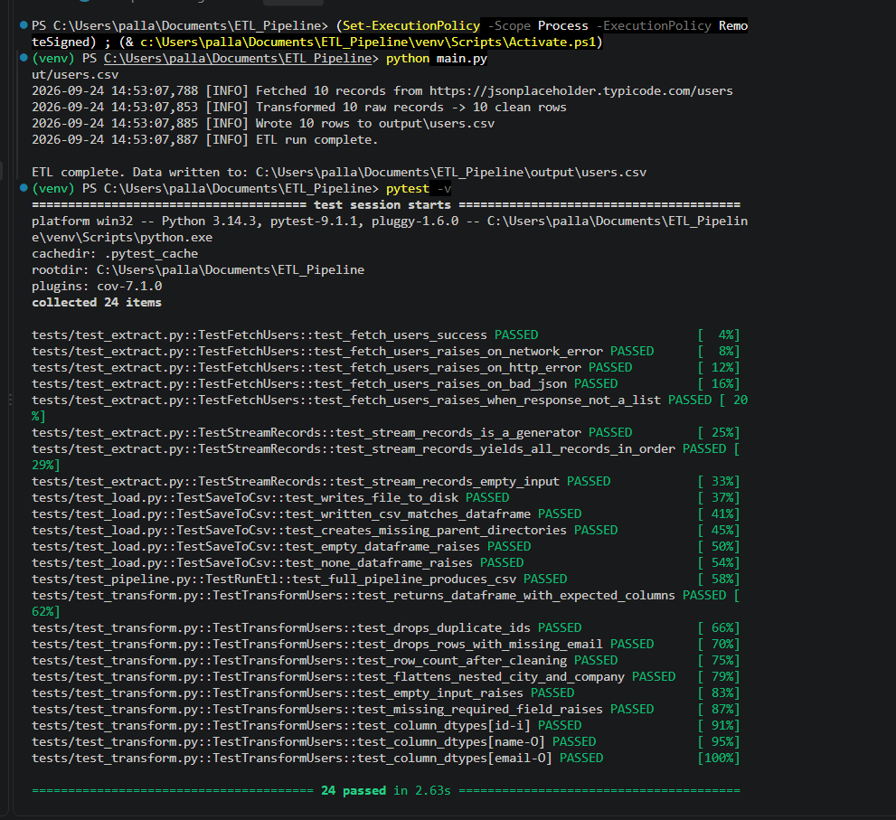

# ETL Pipeline with Unit Tests

A small, well-tested ETL (Extract, Transform, Load) pipeline built in Python. It pulls user data from a public REST API, cleans and reshapes it with pandas, and writes the result to a CSV file — backed by a full pytest test suite.

## What it does

1. **Extract** — fetches JSON user data from a REST API using `requests`
2. **Transform** — flattens nested JSON, drops invalid/duplicate rows, and reshapes the data into a clean pandas DataFrame
3. **Load** — writes the cleaned data to a CSV file

Every step has custom exception handling, and every step is covered by unit tests.

## Project Structure

```
etl_pipeline/
├── main.py                  # Entry point — run this
├── requirements.txt
├── src/
│   ├── extract.py           # API call + generator (stream_records)
│   ├── transform.py         # pandas cleaning/reshaping
│   ├── load.py              # write to CSV
│   └── pipeline.py          # orchestrates extract -> transform -> load
├── tests/
│   ├── conftest.py          # shared pytest fixtures
│   ├── test_extract.py      # mocks requests.get
│   ├── test_transform.py    # includes pytest.mark.parametrize
│   ├── test_load.py         # uses tmp_path fixture
│   └── test_pipeline.py     # end-to-end integration test
└── output/
    └── users.csv             # created after running main.py
```

## Setup

1. Clone the repo and open it in your editor:
   ```bash
   git clone https://github.com/Pallavi-JS/ETL_Pipeline.git
   cd ETL_Pipeline
   ```
2. Create and activate a virtual environment:
   ```bash
   python -m venv venv
   source venv/bin/activate      # Windows: venv\Scripts\activate
   ```
3. Install dependencies:
   ```bash
   pip install -r requirements.txt
   ```

## Run the pipeline

```bash
python main.py
```

This fetches data from a public API, cleans it, and writes `output/users.csv`.

## Run the tests

```bash
pytest -v
```

With coverage:

```bash
pytest --cov=src --cov-report=term-missing
```

## Highlights

- **Generators** — `stream_records()` lazily yields records one at a time
- **Mocked API calls** — tests never hit the real network, so the suite is fast and works offline
- **pytest fixtures & parametrize** — shared test data via `conftest.py`, and multi-case testing with `@pytest.mark.parametrize`
- **Custom exceptions** — every layer (`ExtractionError`, `TransformationError`, `LoadError`) fails loudly and predictably

## Output


